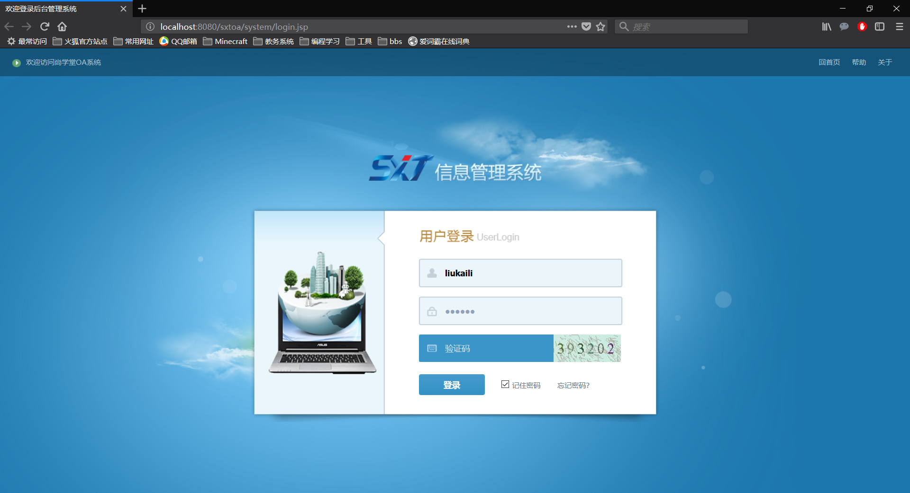
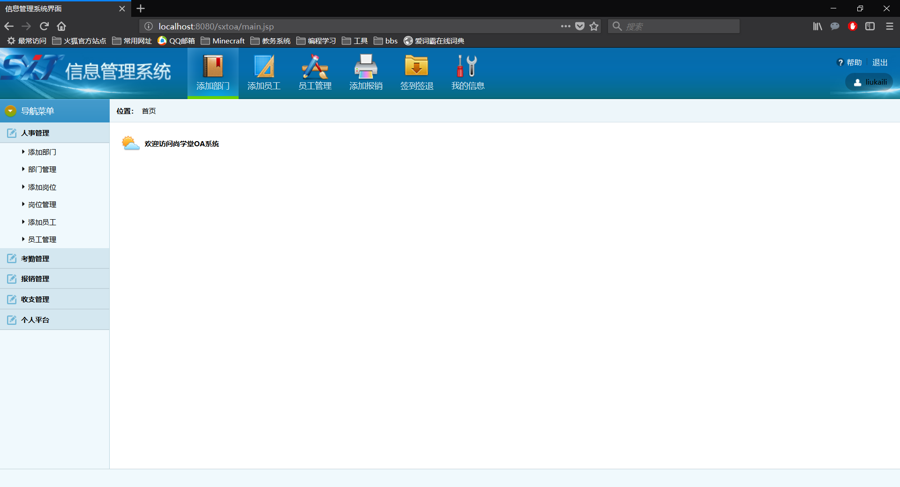
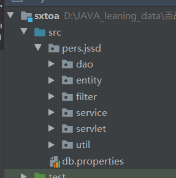

# 尚学堂信息系统项目介绍

## 项目截图

### 项目首页图示

### 项目主界面图示

## 项目背景

此项目是我在学习过程中的练习项目, 通过老师带领, 一步一步实现

## 项目环境

1. jdk1.8
2. tomcat9
3. 使用idea2019.2开发
4. Oracle11g数据库
5. 使用Odbc6进行数据库的连接
6. taglibs1.2.5进行jstl代码书写
7. poi包进行excel导出
8. gson进行java类和json的转换

## 项目功能

主要分为人员的管理, 员工信息管理, 收入支出管理, 考勤管理, 部门岗位管理等模块

## 项目整体结构

1. 实体类: 主要用于和数据库表对应, 操作数据库表
2. dao层: 持久层, 用于进行数据库操作
3. filter层: 过滤器层, 用于进行编码规范过滤, session是否失效的过滤等等
4. service层: 服务层, 用于在项目执行的过程中一些业务方面的处理
5. servlet层: 处理客户端的请求
6. uitl包: 一些必要的工具类

## 项目部署

1. 导入提供的sql文件到oracle数据库
2. 导入项目到idea
3. 配置jdbc中的数据库连接选项
4. 配置tomcat部署项目
5. 访问localhost:8080/sxtoa/system/login.jsp即可访问登录页面

##  数据库测试数据
<pre>
普通管理人员: 
    用户名: liukaili, 密码: 123456
总裁: (无上级)
    用户名: gaoqi, 密码:123456
普通员工
    用户名: gaojiazhi, 密码: 123456
财务管理员
    用户名: furong, 密码: 123456
 </pre>
